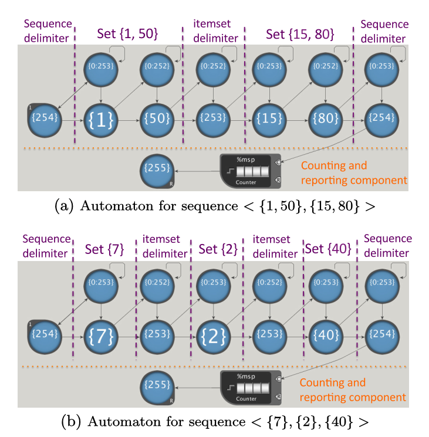

# Sequential Pattern Mining (SPM)
## Description
Sequential pattern mining (SPM) is a widely used data mining technique for discovering common sequences of events in large databases. It identifies strong and interesting sequential relations among variables in structured databases.

A pretty intuitive description of SPM is that it looks for frequent permutations of frequent itemsets, and the order among itemsets/transactions matters. During the purchase of a laptop among all of his transactions, the customer will usually buy the laptop itself and a harddisk first, then flashdrive, and then software packages. Thus in this example the sequence we are mining, if it appears frequently enough, is:
> <{*laptop, harddisk*}, {*flashdrive*}, {*software packages*}>.

In a mathematical description, define the *set of items* *I* = {*i*1, *i*2, ... , *i*m} , where *i*k is usually represented by an integer, call item ID.  
Let the *sequential pattern* (or *sequence*) be *s* = <*t*1 *t*2 ... *t*n> , where *t*k is a transaction and also can be called as an *itemset*.  
Define an *element of a sequence*, a *transaction* or an *itemset* by *t*j = {*x*1, *x*2, ... , *x*m} where *x*k ∈ *I*. In a sequence, one item may occur just once in one transaction but may appear in many transactions. Assume that the order within a transaction (itemset) does not matter.  
We define the *size* of a sequence as the number of *items* in it. A sequence with a size *k* is called a *k*-sequence.  
Sequence *s*1 = <*t*1 *t*2 ... *t*m> is called to be a subsequence of *s*2 = <*r*1 *r*2 ... *r*j> if there are integers 1 ⪯ *k*1 ≺ *k*2 ≺ ... ≺ *k*m-1 ⪯ j such that *t*1 ⊆ *r*k1, *t*2 ⊆ *r*k2, ... *t*m ⊆ *r*km. Such a sequence *s*j is called a *sequential pattern*.  
The *support* for a sequence is the number of total data sequences that contains this sequence. A sequence is known as frequent *iff* its support is greater than a given threshold value called minimum support, *minsup*.  
The goal of SPM is to find out all the sequential patterns whose supports are greater than *minsup*.

### Generalized Sequential Pattern (GSP) Algorithm
Generalized Sequential Pattern (GSP) is one of the competitive candidates in sequential pattern mining. Even though the other two candidates perform better on conventional single-core CPU in average cases, GSP exposes massive parallelism and is considered a better choice for AP structure.

In each pass, the GSP algorithm has two major operations:
1. Candidate Generation: Generating candidates of frequent (*k* + 1)-sequences from known frequent *k*-sequences;
2. Matching and Counting: Matching candidate sequences and counting how many times the input matches a sequence candidate.

The second step of GSP is its performance bottleneck but exposes massive parallelism, and AP is a suitable tool for processing this matching procedure. Since the first step is not accelerated in the AP, this benckmark we are providing is an automaton for matching candidate sequences and counting its supports, and the form of candidates is like:

> <{*A, B*}, {*C*}, {*E*}>.

### Examples and Images
The state machine needs to be converted to state transition elements (STEs) so that it can be represented on AP chips. A single STE can hold a subset of 8-bit symbols and represent an NFA state, so the input stream are also encoded into 8-bit symbols for the matching process, in the case of more frequent items, two conjunctive STEs are used to represent an item.

In the following images we are showing, the numbers from 0 to 252 can be used to encode items, while 255, 254, 253 are reserved as the data-ending reporting symbol, sequence delimiter and itemset delimiter.

Figure 1 shows a basic design for SPM. Each NFA has two rows of STEs. The bottom row is for the actual symbols in a candidate sequential pattern. The STEs in the top row, called “position holders”, help to deal with the discontinuous situations (between itemsets or within itemsets). STEs with {0:253} are called "itemset position holders", and will stay activated before the end of a sequence and handle discontinuous itemsets within that sequence. The other position holders with {0:252} are called "itemset position holders" and will only hold the positon within an itemset.

  

<i><b>Figure 1</b> - Examples of automaton design for sequential pattern matching and counting. The numbers on an STE represent the symbol set that STE can match. "0:252" means any item ID in the range of ASCII 0-252. Symbols "255", "254", "253"are reserved as the input ending, sequence delimiter and itemset delimiter.  <b>[1]</b>   </i>

## Inputs
### SPM_1MB.input
### SPM_10MB.input

## References
[1] Ke Wang, Elaheh Sadredini, and Kevin Skadron. 2016. Sequential pattern mining with the Micron automata processor. In Proceedings of the ACM International Conference on Computing Frontiers (CF '16). ACM, New York, NY, USA, 135-144. DOI: http://dx.doi.org/10.1145/2903150.2903172
